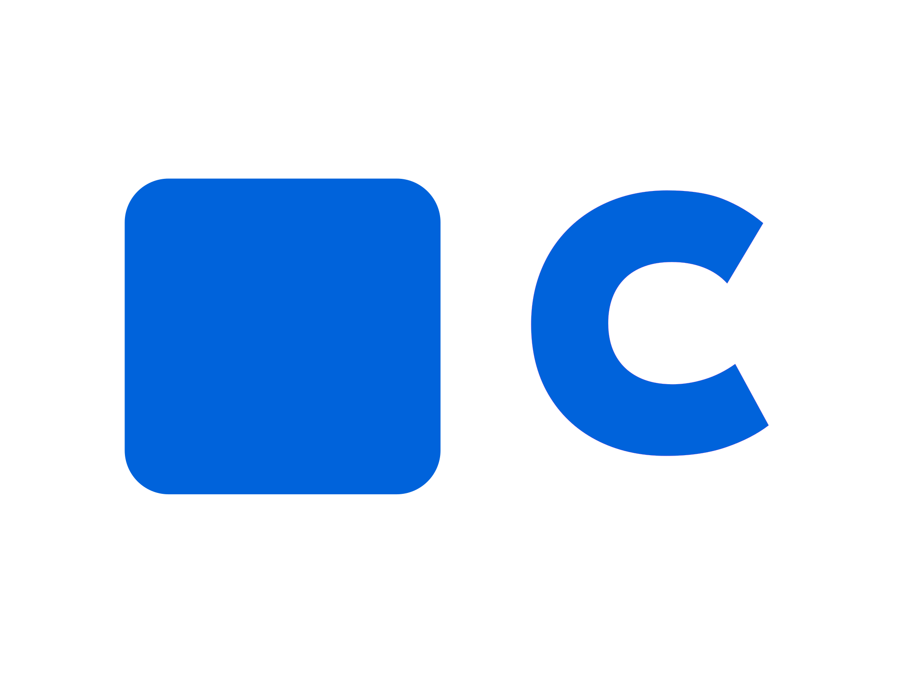

# **Callr: Video Meets App**

**Callr** is a video calling application that allows users to connect seamlessly for one-on-one and group video calls. Designed for simplicity and performance, Callr integrates video conferencing, chat features, and a modern, scalable backend to deliver an exceptional communication experience.

---

## 🔧 **Technologies Used**

### **Frontend**

- **Framework**: Flutter
- **Features**:
  - Cross-platform compatibility (Android, iOS, Web)
  - Responsive UI
  - Clean Architecture for maintainable code

### **Backend**

- **Language**: Node.js (Express.js)
- **Features**:
  - RESTful APIs for seamless client-server communication
  - Scalable architecture with support for real-time operations

### **RTC Engine**

- **Agora**
  - Low-latency audio and video communication
  - Adaptive quality based on network conditions

### **Chat**

- **Socket.IO**
  - Real-time, bidirectional communication for group and private chats

---

## 🌟 **Features**

### **Core Features**

- High-quality one-on-one and group video calls
- Real-time chat during video sessions
- Easy-to-use event scheduling for video conferences
- Dynamic bandwidth adaptation for uninterrupted communication

### **Advanced Features**

- User authentication with secure token generation
- Multi-device support
- Centralized logging for debugging and analytics

---

## 📂 **Project Structure**

Here's an overview of the project's folder organization:

```plaintext
|--- /assets                       # Contains app resources like images, icons and fonts
|--- /lib
     |--- /features
          |--- /onboarding         # Onboarding for first time users
          |--- /authentication     # Login, signup, and token management
          |--- /video_call         # Video call logic and UI
          |--- /chat               # Real-time messaging
          |--- /scheduling         # Video call scheduling and management
     |--- /services                # API services and backend communication
     |--- /utils                   # Helper functions and constants
     |--- /widgets                 # Reusable UI components
     |--- main.dart                # App entry point
|--- /scripts                      # Automation and utility scripts
|--- /test                         # Unit and widget tests
```

## 👨🏼‍💻 Build with me

Watch this Playlist on YouTube: [Build Video Conferencing App](https://www.youtube.com/playlist?list=PLVffzalYuErzcvmwT_joT6RYzgtuwgOFm)

## 🌍 Get Involved

Want to contribute? Feel free to:

1. Fork the repo.
2. Create a new branch for your enhancement or fix.
3. Submit a pull request.

🌟 Star the Repository

## 🤝 Stay Connected

Follow me and share your feedback!

<a href="https://www.youtube.com/@RishikeshShede" style="display: inline-block; background-color: #f10235; color: white; padding: 10px 20px; text-decoration: none; border-radius: 8px; margin-right:10px;">Subscribe on <b>YouTube</b></a>
<a href="https://www.instagram.com/rishikeshshede" 
   style="
      display: inline-block; 
      background: linear-gradient(90deg, #821AFF, #BC01DD); 
      color: white; 
      padding: 10px 20px; 
      text-decoration: none; 
      border-radius: 8px;
   ">
Follow on <b>Instagram</b>
</a>

**Made with ❤️ by Rishikesh Shede**
